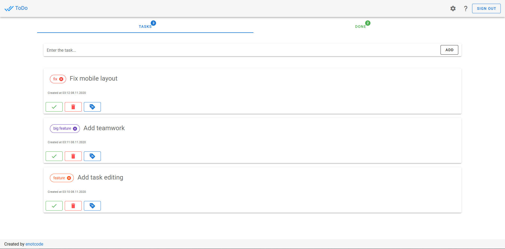

# ToDo

ToDo list on Vue.js and Vuex

### Live demo: [todo.enotcode.com](https://todo.enotcode.com/)



## Used

+ [Vue.js](https://github.com/vuejs/vue)
+ [VueRouter](https://github.com/vuejs/vue-router)
+ [Vuex](https://github.com/vuejs/vuex)
+ [Vuetify](https://github.com/vuetifyjs/vuetify)
+ [axios](https://github.com/axios/axios)
+ [i18n](https://github.com/kazupon/vue-i18n)

## Get started

Clone repo: `https://github.com/enotcode/todo.git`

Create local env with firebase config. 

## Project setup
```
yarn install
```

### Compiles and hot-reloads for development
```
yarn serve
```

### Compiles and minifies for production
```
yarn build
```

### Lints and fixes files
```
yarn lint
```
